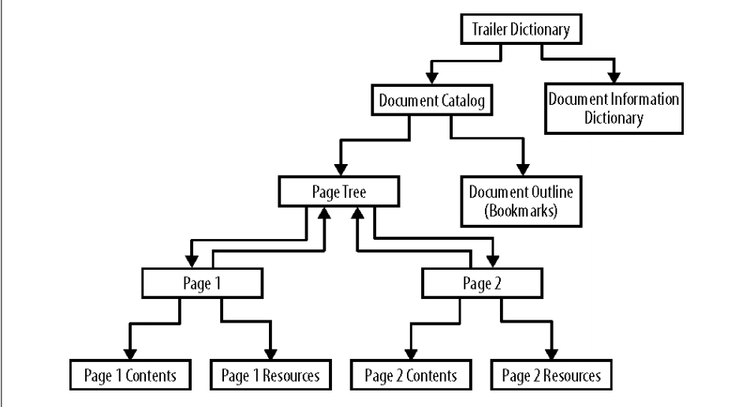

# pdf

## PDF对象

* 数字 42，3.1415
* 字符串  (用括号括起来是字符串)
* 名称 /用斜线开头为名称
* 逻辑类型 true和false
* null值 null
* 数组 [0 0 0]
* 字典 <</Content 5 0 R /Resources 4 0 R>>
* 文件流
* 引用 6 0 R

## 读取pdf

1. 读取pdf文件开头的行，获取pdf的版本号；

   ```html
   %PDF-1.1
   ```

   

2. 读取文件末尾的文件结束符，再读取交叉引用表；

   ```html
   startxref
   705
   %%EOF
   ```

   

3. 根据交叉引用表，读取pdf对象；


## 写入pdf

1. 写入pdf版本号；
2. 将对象编号，并将对象写入文件，记下每个对象在二进制流中的位置；
3. 对象写完后，根据记下的位置写交叉引用表；
4. 写入文件结束符；

## pdf重要对象


*  trailer dictionary

* document catalog

* page tree

  

